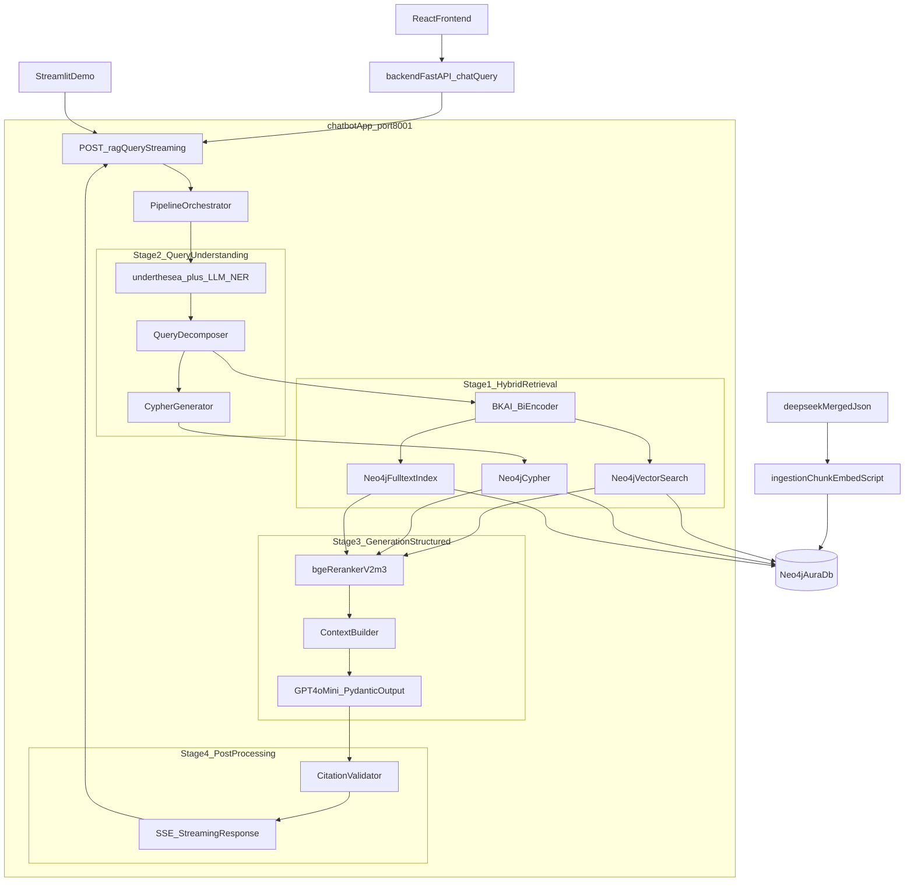

# Kế hoạch xây dựng Chatbot RAG BLHS hoàn chỉnh

## 1. Quyết định kỹ thuật đã chốt

- Embedding tiếng Việt: `bkai-foundation-models/vietnamese-bi-encoder` (768d, sentence-transformers)
- Vector store: Neo4j 5.x **vector index** trên cùng database đã có graph
- LLM: OpenAI `gpt-4o-mini` (đã có key trong `chatbot/.env`)
- NER hybrid: `underthesea` làm baseline + LLM structured output bổ sung
- Reranker: `BAAI/bge-reranker-v2-m3` (multilingual, hỗ trợ vi)
- Chunking: multi-level — embed Điều (411) và Khoản/QuyTac (1326)
- UI: React frontend (production qua `backend/.../chat.py`) + Streamlit demo nội bộ
- Service mới đặt tại `chatbot/app/` chạy port `8001` để khớp với `CHATBOT_URL` mặc định trong [backend/app/routers/chat.py](backend/app/routers/chat.py)

## 2. Kiến trúc tổng thể




## 3. Cấu trúc thư mục đề xuất

```
chatbot/
  .env                                  (giữ nguyên)
  import_blhs_neo4j.ipynb               (giữ nguyên)
  requirements.txt                      (mới, gộp deps)
  dataset/                              (giữ nguyên)
  app/                                  (FastAPI service mới, port 8001)
    main.py
    core/
      config.py
      neo4j_driver.py
      logging.py
    models/
      schemas.py            # Pydantic Request/Response/Citation
      legal_output.py       # ToiDanh, VaiTro, MucPhat output schema
    routers/
      rag.py                # POST /rag/query (streaming SSE)
      health.py             # GET /health, /readyz
    nlp/
      ner.py                # underthesea + LLM hybrid
      decomposer.py         # tách sub-query theo từng đối tượng
      cypher_gen.py         # few-shot Cypher generator
    retrievers/
      embedding.py          # BKAI bi-encoder wrapper (cache + batch)
      vector.py             # Neo4j vector index search
      graph.py              # Cypher templates
      fulltext.py           # tận dụng dieu_name_search, dk_text_search có sẵn
      hybrid.py             # RRF (Reciprocal Rank Fusion) + filter
      reranker.py           # bge-reranker-v2-m3
    pipeline/
      orchestrator.py       # 4-stage pipeline
      prompts.py            # system + few-shot prompts (Cypher, Answer)
      context_builder.py
    postprocessing/
      validator.py          # bắt buộc mọi điều luật trong answer phải có trong context
  ingestion/
    chunk_embed.py          # CLI: load deepseek_merged.json, chunk, embed, ghi Neo4j
    verify_index.py         # smoke test sau khi index xong
  streamlit_app/
    app.py                  # demo UI
  eval/
    test_cases.yaml         # ~30 case mẫu (giết người, cướp, ma tuý, đồng phạm…)
    ragas_eval.py
  tests/
    test_ner.py
    test_retrievers.py
    test_pipeline.py
```

## 4. Giai đoạn 1 — Embedding & Hybrid Retrieval

### 4.1 Mở rộng schema Neo4j (script ingest, không sửa notebook hiện tại)

Thêm vector index lên 2 mức:

```cypher
CREATE VECTOR INDEX dieu_embedding IF NOT EXISTS
FOR (d:DieuLuat) ON d.embedding
OPTIONS {indexConfig: {
  `vector.dimensions`: 768,
  `vector.similarity_function`: 'cosine'
}};

CREATE VECTOR INDEX rule_embedding IF NOT EXISTS
FOR (r:QuyTac) ON r.embedding
OPTIONAL {indexConfig: {
  `vector.dimensions`: 768,
  `vector.similarity_function`: 'cosine'
}};
```

### 4.2 Multi-level chunking trong [chatbot/ingestion/chunk_embed.py](chatbot/ingestion/chunk_embed.py)

- **Chunk Điều (coarse, 411)**: `chunk_text = "Điều {article}. {name}\n" + tổng hợp text các DieuKien thuộc QuyTac BASE`
- **Chunk Khoản (fine, ~1326)**: `chunk_text = "Điều {article} khoản {clause} ({logic}): " + nối text các DieuKien + mô tả HinhPhat`
- Lưu lại `chunk_text`, `embedding`, `token_count`, `provenance` (article, clause, rule_id) trên chính node `DieuLuat`/`QuyTac` (không tạo label mới)
- Batch embed 32–64 chunk/lần bằng `sentence-transformers`, ghi qua `UNWIND $rows MERGE … SET … += {embedding: row.emb}`
- Smoke test cuối script: query `db.index.vector.queryNodes('rule_embedding', 5, $q_emb)` với câu mẫu `"cướp tài sản giá trị 500 triệu"` để xác nhận index hoạt động

### 4.3 Hybrid retrieval trong [chatbot/app/retrievers/hybrid.py](chatbot/app/retrievers/hybrid.py)

3 nguồn → fuse:

1. Vector search Khoản (top 20)
2. Vector search Điều (top 10) — coarse-to-fine, dùng để mở rộng bối cảnh điều luật
3. Fulltext `dieu_name_search` + `dk_text_search` đã có sẵn từ notebook (top 10)
4. Graph traversal: nếu NER trích được `điều X / khoản Y` thì truy thẳng

Hợp nhất bằng **Reciprocal Rank Fusion** với hằng số `k=60`, output top 30 đưa cho reranker.

## 5. Giai đoạn 2 — Query Understanding

### 5.1 NER hybrid trong [chatbot/app/nlp/ner.py](chatbot/app/nlp/ner.py)

- Bước nhanh: `underthesea.ner(text)` trả về (`PER`, `ORG`, `LOC`, `MISC`)
- Bước LLM bổ sung: gọi `gpt-4o-mini` với schema Pydantic:

```python
class CaseEntities(BaseModel):
    actors: list[Actor]            # ten, vai_tro_du_doan, hanh_vi
    roles: list[str]               # chu muu, dong pham, giup suc, xui giuc
    actions: list[str]             # giet nguoi, cuop, hiep dam ...
    objects: list[str]             # tai san, vu khi, nan nhan ...
    amounts: list[Amount]          # so tien, dien tich, ti le %
    article_refs: list[ArticleRef] # dieu, khoan da neu trong cau hoi
```

- Cache trong Redis hoặc lru_cache theo normalized question

### 5.2 Cypher generator trong [chatbot/app/nlp/cypher_gen.py](chatbot/app/nlp/cypher_gen.py)

- Few-shot prompt với 6–8 ví dụ Cypher template chuẩn (đã viết sẵn trong code, không gọi LLM nếu match pattern đơn giản)
- Patterns: tìm theo điều, theo khoản, theo tội danh, theo vai trò đồng phạm, theo tình tiết tăng nặng, theo mức tiền
- Có **whitelist** label/relationship để chặn injection: chỉ cho phép `Phan/Chuong/DieuLuat/QuyTac/DieuKien/HinhPhat/VaiTro/TinhTiet/NhomToi`

### 5.3 Query decomposition trong [chatbot/app/nlp/decomposer.py](chatbot/app/nlp/decomposer.py)

- Khi NER phát hiện ≥ 2 actor, tách thành nhiều sub-query (`A đã làm gì`, `B đã làm gì`, `vai trò A/B`)
- Mỗi sub-query đi qua hybrid retrieval riêng, gộp lại ở context builder

## 6. Giai đoạn 3 — Generation & Structured Output

### 6.1 Reranker [chatbot/app/retrievers/reranker.py](chatbot/app/retrievers/reranker.py)

- `BAAI/bge-reranker-v2-m3` cross-encoder, batch 16
- Input: (question, chunk_text) → score; giữ top 8 sau rerank

### 6.2 Pydantic legal output [chatbot/app/models/legal_output.py](chatbot/app/models/legal_output.py)

```python
class HinhPhatOutput(BaseModel):
    loai: Literal["tu", "cai_tao", "phat_tien", "tu_chung_than", "tu_hinh"]
    min: float | None
    max: float | None
    don_vi: str | None        # nam, thang, dong
    extra: str | None

class ToiDanhOutput(BaseModel):
    dieu: int
    khoan: int | None
    ten_toi: str
    nhom_toi: str | None
    vai_tro: str | None       # chinh pham / dong pham / xui giuc / giup suc
    tinh_tiet_tang_nang: list[str] = []
    tinh_tiet_giam_nhe: list[str] = []
    hinh_phat: HinhPhatOutput
    citations: list[Citation]  # rule_id, source_chunk_id

class CaseAnalysis(BaseModel):
    summary: str
    actors: list[ActorAnalysis]   # mỗi actor có list[ToiDanhOutput]
    overall_advice: str | None
    confidence: Literal["high", "medium", "low"]
```

### 6.3 Prompt design trong [chatbot/app/pipeline/prompts.py](chatbot/app/pipeline/prompts.py)

- System prompt: vai trò "luật sư hình sự Việt Nam", trích đúng số điều/khoản, không bịa
- Few-shot: 3 case (1 actor đơn giản, 1 đồng phạm 2 actor, 1 nhiều tội danh chồng nhau)
- Context được format theo block: `[Điều X khoản Y - tên tội]\n<text>\n[citations: rule_id]`
- Gọi `client.chat.completions.parse(...)` với `response_format=CaseAnalysis`

## 7. Giai đoạn 4 — Serving & Evaluation

### 7.1 FastAPI service [chatbot/app/main.py](chatbot/app/main.py) (port 8001)

- `POST /rag/query` — JSON `{question, top_k}`, trả `CaseAnalysis` đầy đủ (giữ tương thích với [backend/app/routers/chat.py](backend/app/routers/chat.py) hiện tại)
- `POST /rag/query/stream` — SSE streaming theo từng giai đoạn (`stage1_done`, `stage2_done`, `stage3_token`, `stage4_done`) để frontend hiển thị progress
- `GET /health` (live), `GET /readyz` (Neo4j + embedding model + reranker đã load)
- Dùng `lifespan` của FastAPI để load model 1 lần (BKAI ~500MB, reranker ~600MB)

### 7.2 Tích hợp với React qua backend cũ

- Không cần sửa logic trong [backend/app/routers/chat.py](backend/app/routers/chat.py) — endpoint `/rag/query` đã match
- Có thể bổ sung 1 route forward thêm cho streaming nếu muốn (giai đoạn sau)

### 7.3 Streamlit demo [chatbot/streamlit_app/app.py](chatbot/streamlit_app/app.py)

- Sidebar: chọn top_k, toggle “show retrieval debug”
- Main: chat input, hiển thị `CaseAnalysis` dạng card (mỗi actor 1 expander, mỗi tội danh 1 badge điều/khoản + bảng hình phạt)
- Debug panel: list chunks retrieved (vector / fulltext / graph), score, source

### 7.4 Evaluation [chatbot/eval/](chatbot/eval/)

- `test_cases.yaml`: 30 case, mỗi case có `question`, `expected_articles`, `expected_clauses`, `expected_actors`
- `ragas_eval.py`: chạy RAGAS metrics `faithfulness`, `answer_relevancy`, `context_recall`, `context_precision`
- `tests/`: pytest cho từng module (NER, retriever, validator, e2e)

## 8. Post-processing guardrail

[chatbot/app/postprocessing/validator.py](chatbot/app/postprocessing/validator.py):

- Mọi `dieu/khoan` xuất hiện trong `CaseAnalysis` phải tồn tại trong `retrieved_chunks` hoặc trong Neo4j (`MATCH (d:DieuLuat {article: $art})`)
- Nếu không khớp → mark `confidence="low"` và prepend cảnh báo `"Cần thẩm định thêm: thông tin chưa đủ căn cứ trong cơ sở luật"`
- Tất cả `Citation` phải có `rule_id` hợp lệ; loại bỏ citation không match

## 9. Dependencies sẽ thêm vào [chatbot/requirements.txt](chatbot/requirements.txt)

```
fastapi[standard]
uvicorn
neo4j>=5.13
python-dotenv
openai>=1.40.0
pydantic>=2.7
sentence-transformers>=3.0
torch
underthesea>=6.8
FlagEmbedding             # bge-reranker-v2-m3
streamlit
ragas
pytest
httpx
sse-starlette
tqdm
```

## 10. Thứ tự thực thi (chuyển sang Agent mode sau khi confirm)

Mỗi todo dưới đây tương ứng 1 PR/commit gọn, có test/demo riêng để bạn nghiệm thu từng bước.