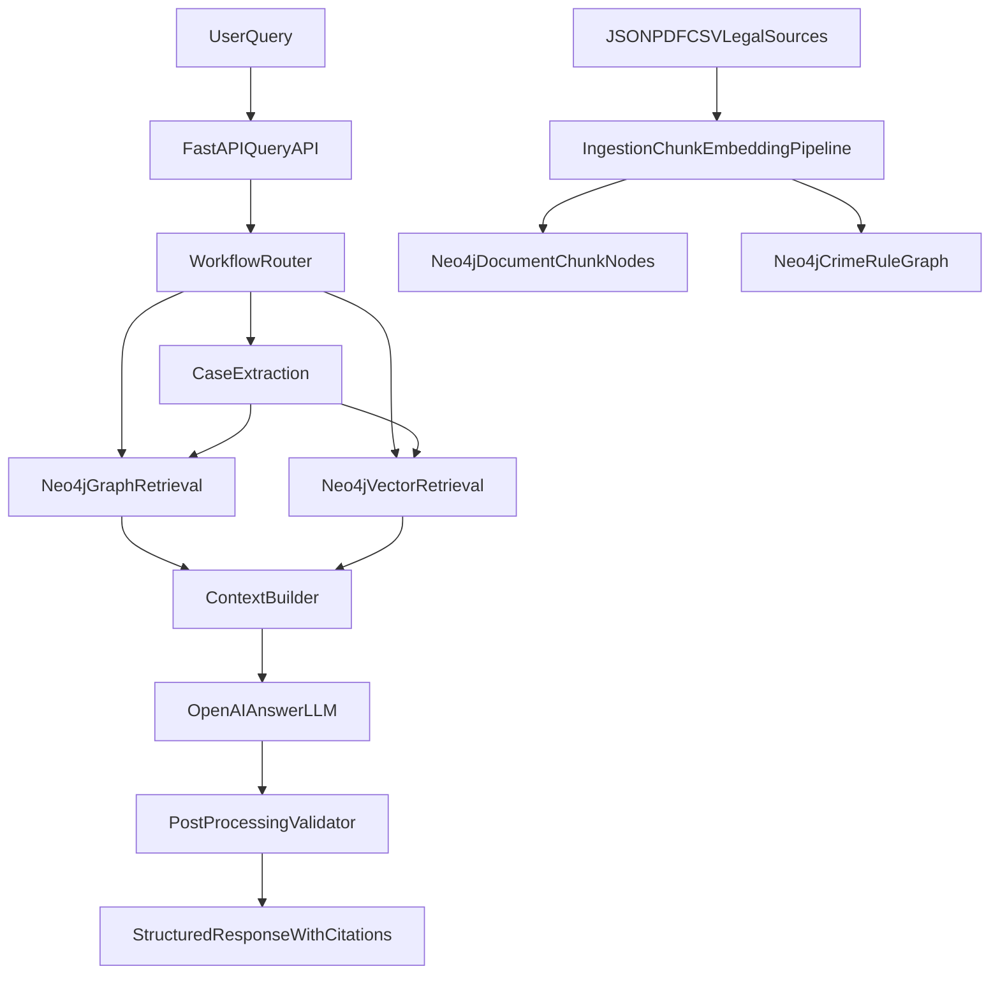

# Kế hoạch nâng `chatbot_rag` theo hướng RAG của PDF

Hiện trạng: `[chatbot_rag/legal_rag_service.py](chatbot_rag/legal_rag_service.py)` đang thiên về heuristic + đối chiếu một tập điều luật cố định; đây chưa phải semantic RAG đúng nghĩa. Hướng phù hợp nhất là chuyển sang **hybrid legal RAG**:

- Neo4j tiếp tục giữ **legal graph/rule store**.
- Neo4j đồng thời lưu **document chunks + vector embeddings** để semantic search.
- OpenAI API key dùng cho **embeddings** và **LLM trả lời/tách ý**.
- Giữ lại phần phân tích nhiều đối tượng của service hiện tại như một lớp workflow chuyên biệt cho bài toán hình sự nhiều người.

## Kiến trúc đích

## Thay đổi chính

1. **Data Augmentation** trong `[chatbot_rag](chatbot_rag)`

- Tạo lớp ingest mới để chuyển nguồn luật từ PDF/JSON thành `DocumentChunk` có metadata: `source`, `article`, `clause`, `title`, `chunk_text`, `token_count`, `provenance`.
- Nếu Neo4j hỗ trợ vector index, lưu embedding ngay trong Neo4j để tránh thêm vector DB khác.
- Giữ các node `Crime`, `Rule`, `Condition`, `Penalty` hiện có; bổ sung liên kết từ chunk sang article/rule tương ứng để truy xuất provenance rõ ràng.
- Không vectorize mù quáng mọi field có cấu trúc; chỉ vectorize phần văn bản luật/giải thích có ngữ nghĩa, đúng khuyến nghị trong PDF.

1. **Inference** trong `[chatbot_rag/legal_rag_service.py](chatbot_rag/legal_rag_service.py)`

- Thay cơ chế `_fetch_rows_for_articles(DEFAULT_TARGET_ARTICLES)` bằng hybrid retrieval:
  - graph retrieval: lấy rule/penalty theo article, clause, tội danh nghi ngờ;
  - vector retrieval: semantic search trên `DocumentChunk` để lấy điều luật, giải thích, nội dung điều/khoản gần nghĩa.
- Dùng OpenAI embeddings để encode query; dùng Neo4j vector search để lấy top-k chunks.
- Hợp nhất context và rerank đơn giản theo: `semantic_score + article_match + clause_match + person_role_match`.

1. **Workflows** cho câu hỏi pháp lý nhiều ý

- Tách workflow thành các bước độc lập: `extract_case`, `route_query`, `retrieve_context`, `reason_per_person`, `generate_answer`.
- Với câu hỏi nhiều người/nhiều hành vi, cho router quyết định gọi graph retrieval, vector retrieval, hay cả hai.
- Giữ heuristic hiện tại làm fallback khi thiếu API key, thiếu vector index, hoặc Neo4j không sẵn sàng.
- Có thể thêm cache mức query normalized để tránh gọi LLM lặp lại cho cùng câu hỏi.

1. **Post-Processing** để giảm hallucination

- Thêm bước kiểm tra mọi điều luật được nêu trong câu trả lời phải xuất hiện trong context retrieve hoặc trong graph result.
- Nếu confidence thấp hoặc thiếu căn cứ, ép response về dạng `cần điều tra thêm` thay vì kết luận mạnh.
- Trả thêm citations/provenance trong API response để frontend/backend có thể hiển thị nguồn.

## File nên chỉnh trọng tâm

- `[chatbot_rag/legal_rag_service.py](chatbot_rag/legal_rag_service.py)`: tách service thành retrieval pipeline rõ ràng, thêm vector retrieval, rerank, validator.
- `[chatbot_rag/models.py](chatbot_rag/models.py)`: thêm model cho `Citation`, `RetrievedChunk`, `RetrievalMetadata`, có thể thêm `source_type` và `provenance`.
- `[chatbot_rag/main.py](chatbot_rag/main.py)`: nạp thêm cấu hình embedding model, vector index, feature flags cho fallback.
- `[chatbot_rag/tests/test_multi_person_pipeline.py](chatbot_rag/tests/test_multi_person_pipeline.py)`: cập nhật test cho hybrid retrieval, citations, fallback.
- Tạo thêm các file mới kiểu:
  - `[chatbot_rag/retrievers.py](chatbot_rag/retrievers.py)`
  - `[chatbot_rag/ingestion.py](chatbot_rag/ingestion.py)`
  - `[chatbot_rag/postprocessing.py](chatbot_rag/postprocessing.py)`
  - `[chatbot_rag/docs/rag-architecture.md](chatbot_rag/docs/rag-architecture.md)`

## Quyết định kỹ thuật mặc định

- **Neo4j** là lựa chọn mặc định cho cả graph store và vector search, để không phải thêm Pinecone/Qdrant.
- **OpenAI API key** dùng cho cả `text-embedding-3-small` hoặc `text-embedding-3-large` và model trả lời hiện tại.
- **Heuristic hiện có không bỏ ngay**; chuyển thành fallback/guardrail thay vì logic chính duy nhất.
- **Notebook import hiện tại** sẽ dần được thay bằng ingest script chạy được ngoài notebook để thuận CI/test.

## Rủi ro cần xử lý

- Nếu Neo4j bản đang dùng chưa bật vector index, cần fallback tạm sang JSON-only + heuristic cho đến khi tạo index xong.
- Chất lượng chunking quyết định mạnh độ chính xác; chunk quá dài sẽ làm retrieval nhiễu, quá ngắn sẽ mất ngữ cảnh điều/khoản.
- Bài toán pháp lý cần provenance rất chặt; response không nên chỉ trả `final_answer`, mà nên kèm điều luật và đoạn context cụ thể.

## Kết quả mong đợi

- `chatbot_rag` chuyển từ rule lookup cố định sang **hybrid RAG có semantic retrieval thực sự**.
- Vẫn tận dụng được phần mạnh hiện tại: phân tích nhiều đối tượng, vai trò đồng phạm, rule-based legal mapping.
- Giảm hallucination nhờ context retrieval + validation sau sinh câu trả lời.
- Dễ mở rộng sang thêm nguồn luật/PDF khác mà không phải hard-code article list nữa.

